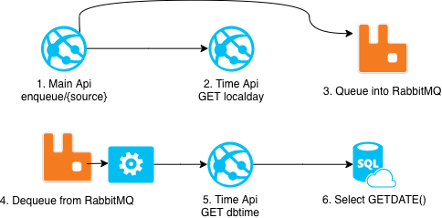
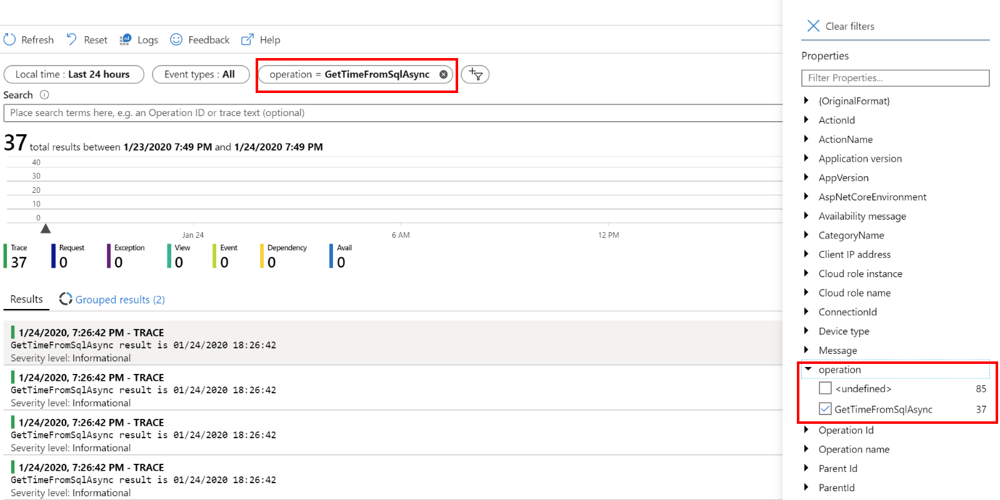
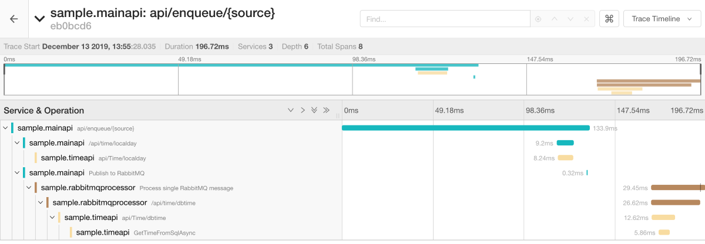
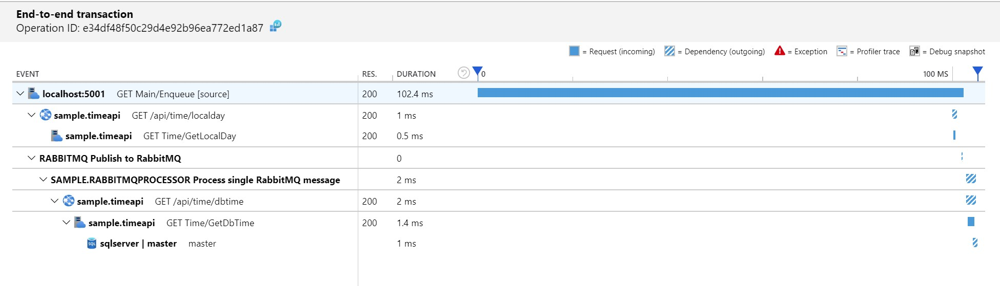
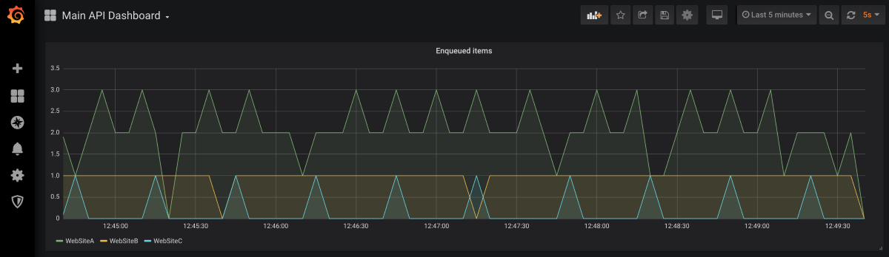

# Official Microsoft Sample

<!-- 
Guidelines on README format: https://review.docs.microsoft.com/help/onboard/admin/samples/concepts/readme-template?branch=master

Guidance on onboarding samples to docs.microsoft.com/samples: https://review.docs.microsoft.com/help/onboard/admin/samples/process/onboarding?branch=master

Taxonomies for products and languages: https://review.docs.microsoft.com/new-hope/information-architecture/metadata/taxonomies?branch=master
-->

This sample application takes a look at current options to implement observability in a ASP.NET Core. It uses OpenTelemetry and Application Insights SDKs to illustrate how logging, tracing and metrics to monitor an application. It contains a distributed transaction example trace including REST, dependencies and RabbitMQ processing.



## Contents

| File/folder       | Description                                |
|-------------------|--------------------------------------------|
| `src`             | Sample source code.                        |
| `quickstart`      | Quick start using docker-compose and pre-built images.                        |
| `.gitignore`      | Define what to ignore at commit time.      |
| `CHANGELOG.md`    | List of changes to the sample.             |
| `CONTRIBUTING.md` | Guidelines for contributing to the sample. |
| `README.md`       | This README file.                          |
| `LICENSE`         | The license for the sample.                |

## Prerequisites

Sample application can be executed in two ways:

- Using docker-compose. It is a great way to get started.
- Downloading source code and running it locally. Using Visual Studio or another IDE. In this case the .NET Core 3.1 SDK is required. To use Jaeger and Prometheues Docker is recommended.

## Setup - Quickstart with docker-compose

To run the application using pre-built images and docker-compose following the guideline below:

### Using OpenTelemetry

1. Clone this repository
1. Open terminal under `quickstart/sample`
1. Execute `docker-compose up` (-d if you don't wish to see console logs)
1. View traces in [Jaeger](http://localhost:16686/)
1. View metrics by searching for "Enqueued_Item" in [Prometheus](http://localhost:9090)
1. Build dashboards in [Grafana](http://localhost:3000/) (admin/password1)

### Using Application Insights SDK

1. Clone this repository
1. Open terminal under `quickstart/sample`
1. Create file `quickstart/sample/.env` with following content:

```env
USE_APPLICATIONINSIGHTS=true
USE_OPENTELEMETRY=false
AI_INSTRUMENTATIONKEY=<ENTER-APPLICATION-INSIGHTS-INSTRUMENTATION-KEY>
```

4. Execute `docker-compose up` (-d if you don't wish to see console logs)
5. View logs, traces and metrics in Azure Portal Application Insights

## Setup - Compile/debug locally

Clone or download the sample from this repository, then open the solution found in root folder using your favorite IDE.

Before running ensure the following dependencies are available:

- SQL Server is available at `server=localhost;user id=sa;password=Pass@Word1;`<br/>
A way to accomplish it is to run as a linux docker container:

```bash
docker run --name sqlserver -e "ACCEPT_EULA=Y" -e "SA_PASSWORD=Pass@Word1" -p 1433:1433 -d mcr.microsoft.com/mssql/server:2019-GA-ubuntu-16.04
```

- When using OpenTelemetry, ensure Jaeger is running locally

```bash
docker run -d --name jaeger \
        -e COLLECTOR_ZIPKIN_HTTP_PORT=9411 \
        -p 5775:5775/udp \
        -p 6831:6831/udp \
        -p 6832:6832/udp \
        -p 5778:5778 \
        -p 16686:16686 \
        -p 14268:14268 \
        -p 9411:9411 \
        jaegertracing/all-in-one
```

- When using OpenTelemetry, in order to visualize metrics ensure Grafana and Prometheus are running locally. A docker-compose file is ready to run under `quickstart/prometheus-grafana`. Open terminal in the mentioned folder and execute `docker-compose up -d`.<br/>To visualize it, open Grafana on your browser at [http://localhost:3000](http://localhost:3000) (credentials are admin/password1). Next, add Prometheus as data source (URL is http://prometheus:9090).

- When using Application Insights, ensure the instrumentation key is set (a simpler way to provide settings to all applications is to create file appsettings.Development.json in folder ./shared):

```json
{
    "SampleApp": {
        "UseApplicationInsights": "true",
        "UseOpenTelemetry": "false",
        "ApplicationInsightsInstrumentationKey": "<Instrumentation key>"
    }
}
```

#### Generating load

The application will only collect data once it starts to receive load. To generate load use the following scripts:

Enqueuing from "WebSiteA" every 2 seconds

```cmd
watch -n 2 curl --request GET http://localhost:5001/api/enqueue/WebSiteA
```

```powershell
while (1) {Invoke-WebRequest -Uri http://localhost:5001/api/enqueue/WebSiteA; sleep 2}
```

Enqueuing from "WebSiteB" every 10 seconds

```cmd
watch -n 10 curl --request GET http://localhost:5001/api/enqueue/WebSiteB
```

```powershell
while (1) {Invoke-WebRequest -Uri http://localhost:5001/api/enqueue/WebSiteB; sleep 10}
```

Enqueuing from "WebSiteC" every 30 seconds

```cmd
watch -n 30 curl --request GET http://localhost:5001/api/enqueue/WebSiteC
```

```powershell
while (1) {Invoke-WebRequest -Uri http://localhost:5001/api/enqueue/WebSiteC; sleep 30}
```

## Key concepts

Goal of the sample application is to demonstrate ways you can add the 3 observability pillars to your ASP.NET Core application:

### Logging

Collects information about events happening in the system, helping the team analyze unexpected application behavior. Searching through the logs of suspect services can provide the necessary hint to identify the problem root cause: service is throwing out of memory exceptions, app configuration does not reflect expected values, calls to external service have incorrect address, calls to external service returns unexpected results, incoming requests have unexpected input, etc.

Logging with Application Insights:



### Traces

Collects information in order to create an end-to-end view of how transactions are executed in a distributed system. A trace is like a stack trace spanning multiple applications. Once a problem has been recognized, traces are a good starting point in identifying the source in distributed operations: calls from service A to B are taking longer than normal, service payment calls are failing, etc.

Traces with Jaeger:



Traces with Application Insights:



### Metrics

Provide a near real-time indication of how the system is running. Can be leveraged to build alerts, allowing proactive reactance to unexpected values. As opposed to logs and traces, the amount of data collected using metrics remains constant as the system load increases. Application problems are often first detected through abnormal metric values: CPU usage is higher than before, payment error count is spiking, queued item count keeps growing.

Metrics with 


## Contributing

This project welcomes contributions and suggestions.  Most contributions require you to agree to a
Contributor License Agreement (CLA) declaring that you have the right to, and actually do, grant us
the rights to use your contribution. For details, visit https://cla.opensource.microsoft.com.

When you submit a pull request, a CLA bot will automatically determine whether you need to provide
a CLA and decorate the PR appropriately (e.g., status check, comment). Simply follow the instructions
provided by the bot. You will only need to do this once across all repos using our CLA.

This project has adopted the [Microsoft Open Source Code of Conduct](https://opensource.microsoft.com/codeofconduct/).
For more information see the [Code of Conduct FAQ](https://opensource.microsoft.com/codeofconduct/faq/) or
contact [opencode@microsoft.com](mailto:opencode@microsoft.com) with any additional questions or comments.
